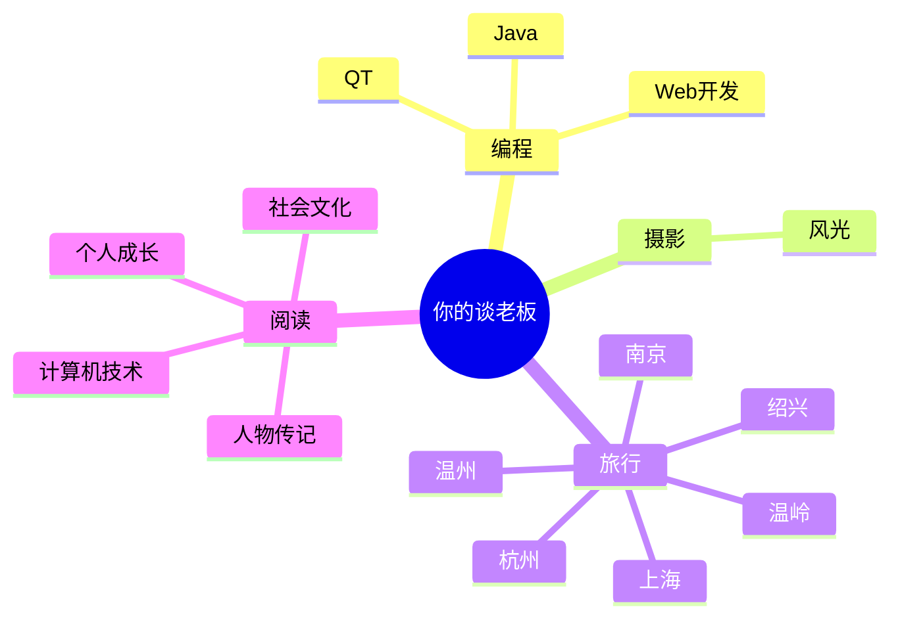

# zzp-create

 <h1 align="center">BlackPig-ZZP</h1>
<h1 align="center">
 <a href="https://sunguoqi.com/">  </a>
</h1>


 <!--
**Bewilder-cell/Bewilder-cell** is a ✨ _special_ ✨ repository because its `README.md` (this file) appears on your GitHub profile.

Here are some ideas to get you started:

- 🔭 I’m currently working on ...
- 🌱 I’m currently learning ...
- 👯 I’m looking to collaborate on ...
- 🤔 I’m looking for help with ...
- 💬 Ask me about ...
- 📫 How to reach me: ...
- 😄 Pronouns: ...
- ⚡ Fun fact: ...
-->


<p align="center">
  
</p>


```text
🌞 Morning                548 commits         ██████░░░░░░░░░░░░░░░░░░░   24.94 % 
🌆 Daytime                704 commits         ████████░░░░░░░░░░░░░░░░░   32.04 % 
🌃 Evening                641 commits         ███████░░░░░░░░░░░░░░░░░░   29.18 % 
🌙 Night                  304 commits         ███░░░░░░░░░░░░░░░░░░░░░░   13.84 % 
```
📅 **I'm Most Productive on Friday** 

```text
Monday                   261 commits         ███░░░░░░░░░░░░░░░░░░░░░░   11.88 % 
Tuesday                  195 commits         ██░░░░░░░░░░░░░░░░░░░░░░░   08.88 % 
Wednesday                310 commits         ████░░░░░░░░░░░░░░░░░░░░░   14.11 % 
Thursday                 258 commits         ███░░░░░░░░░░░░░░░░░░░░░░   11.74 % 
Friday                   662 commits         ████████░░░░░░░░░░░░░░░░░   30.13 % 
Saturday                 187 commits         ██░░░░░░░░░░░░░░░░░░░░░░░   08.51 % 
Sunday                   324 commits         ████░░░░░░░░░░░░░░░░░░░░░   14.75 % 
```


<picture>
  <source media="(prefers-color-scheme: dark)" srcset="https://raw.githubusercontent.com/Bewilder-cell/Bewilder-cell/output/github-contribution-grid-snake-dark.svg">
  <source media="(prefers-color-scheme: light)" srcset="https://raw.githubusercontent.com/Bewilder-cell/Bewilder-cell/output/github-contribution-grid-snake.svg">
  
</picture>



<!--  skill badge 技能徽章 -->

 <p align="center">

 </p>
<h3  align="center">💪 正在学习</h3>
<div align="center" >
 
 


</div>


<h3  align="center"> 🧠 计划学习</h3>
<div align="center" >
 


</div>
<div align="center">
 <!-- svg -->


 


<br>

<!-- gif -->


</div>


<!-- programming tool icon 编程工具图标 -->
<!-- <br> -->
<!-- <p align="center">
  
</p>
 -->
